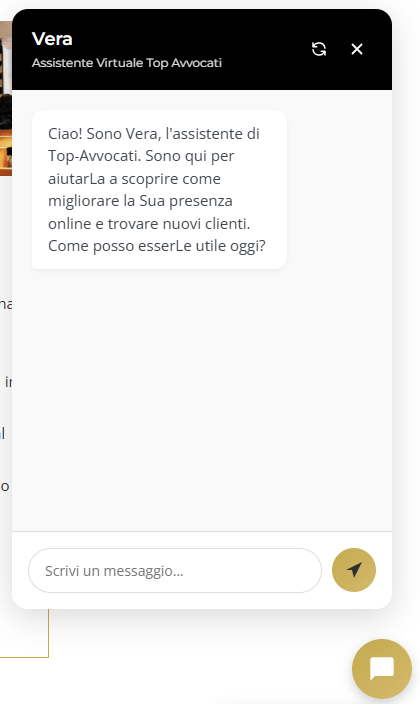
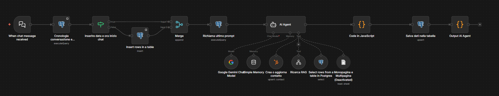

# Top Avvocati RAG Chatbot

An AI-powered chatbot for the Top Avvocati legal services platform, built entirely in n8n. It uses a RAG (Retrieval Augmented Generation) system to guide lawyers toward the most relevant service based on their needs — not through scripted answers, but through a real AI agent that analyzes each message and responds intelligently.

## Demo

**Live chatbot screenshot:**



**Video demo:**

The file `Video-Chat-in-azione.mp4` contains a full recorded session showing the chatbot handling a real conversation — from the initial greeting through service exploration to a consultation booking CTA.

## Workflow Architecture



The system is composed of multiple n8n workflows that work together:

### Main Chat Workflow

This is the core of the system (`Workflow-chatbot.json`). The flow for each incoming message is:

1. **Chat Trigger** — n8n's native chat widget receives the user message
2. **Load Conversation History** — a PostgreSQL query retrieves the full chat history for this session from the `chat_logs` table, including message count and context
3. **Session Check** — if this is a new session (no `conversation_started_at`), a new row is inserted into `chat_logs` with the session start timestamp
4. **Merge** — combines the history data and the new session data into a single flow
5. **Load System Prompt** — a PostgreSQL query fetches the latest version of the system prompt from the `system_prompts` table (allows updating the prompt without touching the workflow)
6. **AI Agent** — Google Gemini processes the user message with the system prompt and conversation context, and decides which tool to call (or responds directly)
7. **Update History** — a JavaScript code node appends the new user message and AI response to the chat history arrays
8. **Save to Database** — the updated history is upserted back into PostgreSQL
9. **Output** — the AI response is returned to the chat widget

### RAG Indexing Workflow (separate)

A dedicated workflow crawls the Top Avvocati website pages and converts them into embedded vectors stored in the database. These vectors are what the RAG search tool queries at runtime to contextualize responses with actual website content.

### Support Workflows

- Error detection and alerting
- Chat history logging and statistics
- Usage monitoring

## AI Agent Tools

The AI agent has access to 4 tools and decides autonomously which to use:

| Tool | When It Is Used |
|---|---|
| **RAG Search** | When the agent needs information about Top Avvocati services or website content. Queries embedded vectors and returns the top 3 most relevant results. |
| **Product Search** | When the user does not know what they want, or when the agent needs details about available products. Queries a PostgreSQL `prodotti` table. |
| **HubSpot Contact** | Only when the user explicitly requests to be contacted or wants a personalized proposal. Collects name, last name, email, city, and legal specialty. |
| **Consultation Booking** | Provides a Calendly link when the conversation reaches a point where a consultation is appropriate. |

Tool usage is guided by the system prompt, but the agent decides the sequence and whether to combine tools based on the conversation.

## Response Format

The AI agent always responds in structured JSON:

```json
{
  "text": "The main response (supports markdown: **bold**, *italic*, - lists)",
  "fonti": [{"text": "Source name", "url": "https://..."}],
  "buttons": [{"text": "Book consultation", "url": "https://..."}],
  "quickReplies": ["Follow-up question 1?", "Follow-up question 2?"]
}
```

- **text** — the visible message. Links are never placed directly in the text field.
- **fonti** — clickable source links from the RAG results, rendered in the chat UI as links the user can tap. Max 2 per response.
- **buttons** — visually distinct CTAs (e.g., "Book Consultation", "Discover Services"). These are styled differently from regular messages.
- **quickReplies** — dynamically generated suggested questions based on the conversation. Used only in the first 7 messages, then the agent converges toward a consultation booking.

This structured format is what makes the chat experience different from a typical chatbot: sources are shown as clickable links, the CTA stands out visually, and suggested questions guide the user without being repetitive.

## Conversation Management

- The system prompt is stored in a dedicated database table (`system_prompts`), not hardcoded in the workflow. This means the prompt can be updated at any time without modifying the workflow itself.
- Chat history is persisted in PostgreSQL across messages within the same session. The agent receives the full conversation context to maintain coherence.
- After 7 messages, the agent stops generating `quickReplies` and starts converging the conversation toward a consultation booking — balancing exploration with conversion.
- The agent uses formal language ("Lei") throughout, matching the professional tone of a legal services platform.

## AI Model

The chatbot uses **Google Gemini** (via n8n's native LangChain integration). The model is connected to the AI Agent node as the language model, with a simple window memory buffer for conversation context.

## Database Schema

The system uses PostgreSQL with these key tables:

- **chat_logs** — stores per-session conversation data: `chat_id`, `message_count`, `chat_history` (JSON array), `chat_history_with_context`, timestamps
- **system_prompts** — stores the current system prompt with `updated_at` for versioning
- **prodotti** — product catalog queried by the Product Search tool

## How to Deploy

1. **Import the workflow** — open n8n, go to Workflows, import `Workflow-chatbot.json`
2. **Set up credentials** — configure:
   - Google Gemini API key (for the AI agent)
   - PostgreSQL connection (for chat_logs, system_prompts, prodotti)
   - HubSpot App Token (for the contact creation tool)
3. **Set up the RAG workflow** — configure and run the separate RAG indexing workflow to crawl your website and populate the vector store
4. **Populate the product table** — insert your service catalog into the `prodotti` table
5. **Write your system prompt** — insert your prompt into the `system_prompts` table. This controls the agent's behavior, tone, service details, and response rules
6. **Activate the chat trigger** — enable the "When chat message received" node and embed the generated chat widget on your website

## Contents

| File | Description |
|---|---|
| `Workflow-chatbot.json` | The main n8n workflow — import this directly into your n8n instance |
| `Workflow-chatbot.png` | Visual diagram of the full workflow |
| `Chat-1.png` | Screenshot of the chatbot in a live conversation |
| `Video-Chat-in-azione.mp4` | Demo video showing a full chatbot session |
